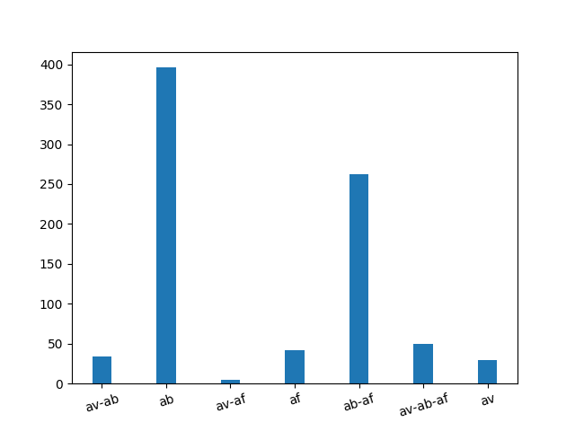

#### Multilabel classification of antimicrobial peptides

By Sourav Singh, Devshree Khavase, Sanika Kulkarni and Sakshi Jain
in collaboration with CMS Department and Bioinformatics Centre, SPPU.

---

#### A background behind the problem

- Curing a disease normally entails using any of the two approaches- Pharmaceuticals and Vaccines.
- Both the approaches have their own problem
- Pharmaceutical drugs take a lot of time to enter the phase where they could be good for human consumption.
- Vaccines require special conditions for storage and maintainance.

---

#### Solution

- Make use of anti-microbial peptides!
- Anti-microbial peptides are special class of peptides synthesized from various organisms like bees, frogs etc 
and are potent drug candidates against microbial organisms such as bacteria, fungi, parasites, and viruses.
- Anti-microbial peptides are easier to synthesize in a lab environment and do not require specialized equipment for storage.
- Are effective against most anti-microbials like E.Coli and diseases like [HIV-1](http://journals.plos.org/plosone/article?id=10.1371/journal.pone.0045208) and [Malaria](https://www.sciencedirect.com/science/article/pii/S0014579399009643)

---

#### Problem Objectives

- Extract data required for classification from online webservers and databases.
- Study various Machine Learning algorithms and the effect on the dataset.
- Develop a web-application for the same.
- Solve the problem of multilabel classification of AMPs since a peptide can act against multiple types of microbes.

---

#### Problem approach

- We start by extracting data on AMPs from databases and webservers.
- Calculate features for the peptide data, which will be used for classification. 
- Pick a classifier and evaluate results on the classifier
- Create a webserver based on the best Machine learning model picked on the basis of evaluation metrics.

---

#### Data Extraction

- We extract data from two sources, [CAMP](http://www.camp.bicnirrh.res.in/) and [APD3](http://aps.unmc.edu/AP/main.php).
- After cleaning and eliminating redundant values, we were able to extract upto 3284 peptide sequences from the webservers.
- The following shows the distribution of the peptides-

---

#### Feature Calculation

- Feature calculation was done by making use of [modlAMP](https://modlamp.org/) 
- Some of the features calculated for the peptide sequences were Length, Aromaticity, Aliphatic Index, Net Charge, Instability Index, and scales based on [Eisenberg et. al.(1984)](https://web.expasy.org/protscale/pscale/Hphob.Eisenberg.html), [Boman, H.G.(2003)](https://www.ncbi.nlm.nih.gov/pubmed/12930229) and [Kyle and Dolittle(1982)](https://www.ncbi.nlm.nih.gov/pubmed/7108955).
- The calculated values for the peptides are used as features which will help an ML model to differentiate and classify peptides of different types.

---

#### Choosing an appropriate ML model

- For choosing an appropriate ML model, baseline model was created and evaluation was done in a five-fold cross-validation using micro-averaged F1-score and AUC-ROC scores.
- Through iterative development, [Gradient Boosting](https://en.wikipedia.org/wiki/Gradient_boosting) working in tandem with Binary Relevance for multi-label classification was found to work well and had an average F1-score of 0.88 and an AUC-ROC score of 0.843 over five-fold cross-validation.
- The final ML algorithm was trained on a subset of the dataset and the small subset of the dataset was used for testing and verifying the behavior of the dataset.    

---

#### Creating a webserver

- The ML algorithm was written in Python using [scikit-learn](https://scikit-learn.org) and the model was serialized for the purposes of the creation of webserver.
- The development of webserver was done using HTML, CSS and [Flask](flask.pocoo.org/) web framework.
- The source code of the project is open-sourced under Apache 2.0 license [here](https://github.com/souravsingh/ML-AMP). Anyone who wishes to improve the project are invited!

---

## Demo time

---

#### Future of the project

- More amount of data would be required to better train the model and to remove biases towards a particular label like anti-bacterial.
- Since Machine Learning is a highly researched field, futher improvements can be done in terms of the model used for the classification.
- Since the model is completely versatile i.e, it doesn't account for the orientation of peptides in 3-D space, work can be done towards classifying peptides better based on the structure of the peptides.

---

#### Acknowledgement

- Thanks to Dr. V.K Jayaraman from CMS Department, SPPU and Dr. Urmila Kulkarni-Kale from Bioinformatics Centre, SPPU for giving the idea and guidance on the project.
- Thanks to the developers of scikit-learn, matplotlib, numpy, scipy and any other packages used for providing the interface for quick development of the machine learning model, helping in evaluation, testing of the model and development of webapp.
- Thanks to UniProt[http://uniprot.org] for giving a resource for testing our model and as a knowledgebase.

---

### Questions?

---
